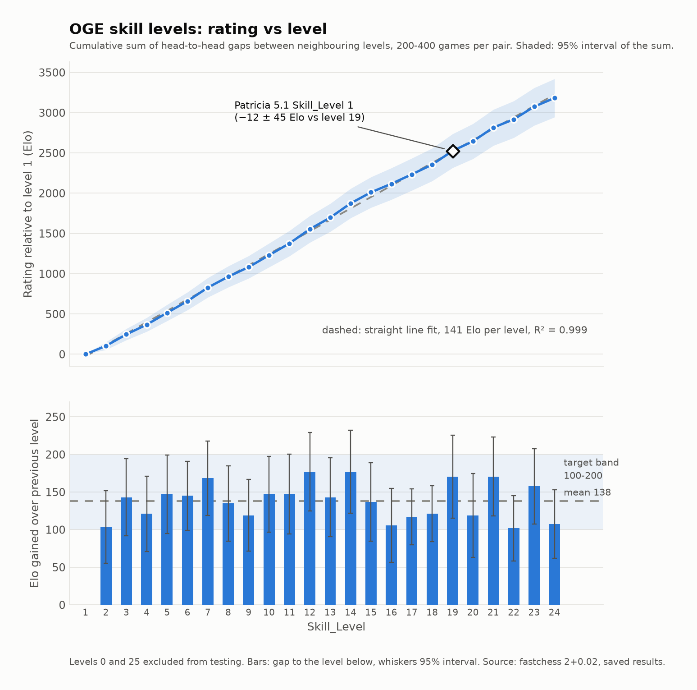
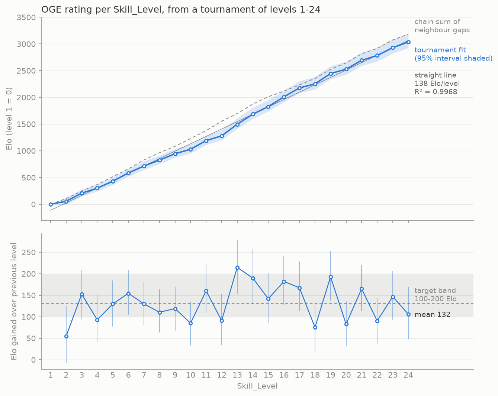

# COLOPHON

## What was used

- **Model:** Claude Fable 5.1 (`claude-fable-5-1`) in Claude Code, driving the work directly.
  Subagents: the first web-app build and the first engine review ran on Fable 5.1 before the
  session hit its usage limit; after that, four review finders ran on Claude Sonnet and the
  web-app fix round on Claude Opus, per the author's request to use cheaper models where they
  suffice. Everything the subagents found was verified and applied by the main session.
- **Tokens:** roughly 2.6 million tokens of model output: about 2.3 million by the subagents
  (their runs reported 474k + 673k + 917k + 230k) and an estimated 0.3 million by the main
  session, whose own usage is not exposed to the model. The main conversation reached about
  350 thousand tokens of context, re-read on each of several hundred turns (most of them short
  status turns while matches were running).
- **Wall-clock time:** 2026-10-01 21:46 to 2026-10-02 09:30 UTC, about 11 hours 45 minutes in total. About 3 hours 20 minutes of that was
  a forced pause when the account's usage limit was reached, and roughly 9 hours was fastchess
  matches running unattended on a 4-core cloud box (about 24,000 games in all).
- **Reference software:** Patricia 5.1 (commit 67d83d7; `Skill_Level` first appeared in Patricia 4
  and Patricia 3.0 has no skill levels at all), fastchess (commit 60d7a7a), python-chess 1.11.2
  as the move-generation oracle, chessground 9.2.1, Bun 1.3.14, Node 22.

## The engine in one paragraph

`engine.js` is a mailbox (array-based) engine: pseudo-legal move generation with Chess960
castling, make/unmake with legality checking, Zobrist hashing in two 32-bit halves, a tapered
PeSTO piece-square evaluation with pawn structure, bishop pair, rook files and a king shield,
and a principal-variation search with transposition table, null-move pruning, reverse futility,
late move reductions and pruning, killer/history/counter-move ordering, check extensions and a
quiescence search. It talks UCI on stdin/stdout under Bun or Node, runs as a Web Worker or plain
script in a browser (`globalThis.OGE`), passes `fastchess --compliance`, and exposes exactly the
options Hash, Threads (always 1), MultiPV (1-5), Skill_Level and UCI_Chess960. At 5+0.05 it
scored 70% against Patricia 5.1 Skill_Level 15 (nominally 2300 Elo).

## How the skill levels work

Level 0 plays a uniformly random legal move, except that it always plays a mate in one. The top
level is the engine at full strength. Every level in between plays like this:

1. The normal search runs with 70% of the move time and returns the best move and its score.
   In the remaining slice the next four root moves are searched two plies shallower, so the top
   five moves carry searched scores. Every other legal move gets a cheap estimate (a quiescence
   search a few plies deep, with mate in one and stalemate recognised), never rated closer to the
   best move than the worst searched line nor closer than 20 cp.
2. A move's loss is the best score minus its own, capped at 2000 cp (a lost game).
3. Each move, budget/40 centipawns are added to the mover's accumulator (capped at the budget).
   One move is picked uniformly at random among those whose loss fits the accumulator, and its
   loss is paid. The budget is the only thing that differs between levels.

With an unlimited budget this is the random mover (measured: -5 +/- 40 Elo against level 0 over
200 games); with a zero budget it is the best move. Because the knob is a centipawn allowance and
not depth, nodes or time, a level's play does not change with the time control; the calibration
below was run at 2+0.02 and spot-checked at 60+0.6.

## Calibration

All matches used fastchess with 600 balanced 8-ply openings generated by the engine itself,
both colours per opening, resign (800 cp for 3 moves, both sides) and draw (10 cp for 8 moves
after move 40) adjudication, 16 MB hash, 4 games at a time on 4 cores.

Procedure: (a) a coarse ladder of budgets at ratio 4 to find the shape of the curve; (b) an
adaptive refinement (`tools/tuning/refine.py`) that inserted the geometric midpoint wherever an
adjacent gap exceeded 220 Elo and dropped a rung below 80 Elo, 100 games per pair; (c) a fresh
verification pass of 200 games for every adjacent pair, followed by repair rounds that moved or
replaced rungs whose 200-game gap fell outside 100-200 Elo (several stretches turned out not to
be additive: for example budget 400 vs 297 measured 60 Elo and 297 vs 193 measured 129, yet
400 vs 193 measured 260). Per the author's instruction during the run, the random mover (level 0)
and full strength (the top level) were excluded from the pairwise tests; only levels 1 to
24 were tuned against each other.

Elo here is the head-to-head difference between neighbours (fastchess pentanomial estimate, 95%
confidence interval). Matchups between two sloppy engines are near-deterministic, so these
pairwise differences are large relative to any absolute rating scale and are not additive along
the ladder; the chain sum is given only as an indication of the range covered.

| Level | Budget (cp / 40 moves) | Elo over previous level (95% CI) | Games |
|---:|---:|---|---:|
| 0 | random mover | – | – |
| 1 | 25369 | not tested (level 0 excluded) | – |
| 2 | 22627 | +104 [57, 154] | 200 |
| 3 | 19027 | +143 [95, 197] | 200 |
| 4 | 17000 | +121 [74, 173] | 200 |
| 5 | 15000 | +147 [98, 203] | 200 |
| 6 | 13455 | +145 [102, 193] | 200 |
| 7 | 11980 | +168 [122, 221] | 200 |
| 8 | 10676 | +135 [88, 188] | 200 |
| 9 | 9514 | +119 [74, 169] | 200 |
| 10 | 8354 | +147 [100, 201] | 200 |
| 11 | 6987 | +147 [97, 204] | 200 |
| 12 | 5844 | +177 [129, 233] | 200 |
| 13 | 4888 | +143 [94, 199] | 200 |
| 14 | 3419 | +177 [126, 237] | 200 |
| 15 | 2650 | +137 [88, 192] | 200 |
| 16 | 2000 | +106 [59, 157] | 200 |
| 17 | 1414 | +117 [81, 156] | 400 |
| 18 | 1000 | +121 [85, 160] | 400 |
| 19 | 620 | +171 [119, 230] | 200 |
| 20 | 450 | +119 [66, 178] | 200 |
| 21 | 270 | +171 [122, 227] | 200 |
| 22 | 193 | +102 [60, 147] | 200 |
| 23 | 100 | +158 [111, 211] | 200 |
| 24 | 60 | +108 [64, 155] | 200 |
| 25 | full strength | not tested (excluded) | – |

Chain sum level 1 -> 24: 3183 Elo (indicative only, see above). Levels 1 to 24 were tested pairwise; the pairs 0→1 and 24→25 were excluded on the author's instruction, so level 1 is simply the largest budget that still differs from the random mover (an unlimited budget measured −5 ± 40 Elo against it) and level 24 is the smallest budget whose step from level 23 is still in band.



The curve is close to a straight line: R² = 0.999, 141 Elo per level, largest deviation 63 Elo (inside the noise). Data: `tools/tuning/skill_curve.csv`.

### Patricia

- Requirement: Patricia Skill_Level 1 at least 100 Elo stronger than engine level 1. SPRT at
  2+0.02 with elo0=100, elo1=200 (logistic model): Patricia won 36–0; H1 (≥ 200 Elo) accepted. At 60+0.6 Patricia won 30–0.
- The engine level that corresponds to Patricia Skill_Level 1 ("Patricia 1v1"): **level 19** (budget 620 cp per 40 moves): Patricia 1 scored 48% against it over 200 games (−12 ± 45 Elo), and +189 Elo against level 18.

| Opponent | Patricia 1 result, 2+0.02 |
|---|---|
| level 18 (budget 1000) | Patricia +189 Elo [136, 251], 200 games |
| level 19 (budget 620) | Patricia −12 Elo [−58, 33], 200 games |
| budget 500 (not a level) | Patricia −92 Elo [−161, −30], 100 games |
| budget 2000 (level 16) | Patricia +676 Elo, 98%, 100 games |

### Time-control spot checks (60+0.6)

| Pair (budgets) | 60+0.6, 30 games | 2+0.02, 200 games |
|---|---|---|
| level 1 vs level 2 (25369 vs 22627) | level 2 is −23 Elo [−130, 79]: inconclusive at this sample size | +104 [57, 154] |
| level 19 vs level 20 (620 vs 400, the rung later moved to 450) | level 20 is +120 Elo [33, 226] | +156 [99, 215] |
| Patricia Skill_Level 1 vs level 1 (25369) | Patricia won 30–0 | Patricia won 36–0 (SPRT) |

No time forfeits occurred in any match of the whole calibration.

## All-levels tournament (levels 1-24)

The neighbour-only calibration above gives a chain-sum curve that had never been checked against games between non-adjacent levels. This run checks it: one tournament over levels 1 to 24 (0 and 25 excluded), every pair with |i-j| <= 6 (123 pairings, 60 games each = 7,380 games, 30 openings from `book.epd` with both colours), fastchess 60d7a7a, 2+0.02, Hash 16, single-threaded `bun engine.js`, 4 concurrent games, 111 minutes, no time losses. One Bradley-Terry maximum-likelihood fit (draw = half a win, level 1 = 0 Elo); 95% intervals from a 2,000-sample bootstrap over openings. A prior of 0.1 point per pairing side keeps 60-0 pairings finite. Engine unchanged. Scripts: `tools/tuning/tournament.py` (runs, resumable), `tools/tuning/tournament_fit.py` (fit and chart); data: `tools/tuning/tournament/pairings/*.json`, `tools/tuning/tournament_ratings.csv`, `tools/tuning/tournament_stats.json`.



**Straight-line fit (tournament ratings):** slope 138.1 Elo per level, R² = 0.9968; largest deviation 126 Elo below the line at level 12 (the 95% interval at level 12 is about 190 Elo wide, so this is roughly within noise).

**Per-level gaps:** mean 132 Elo, standard deviation 43 (each gap carries a 95% half-width of about 57 Elo, so most of that spread is sampling noise). 8 of 23 gaps fall outside 100-200 by point estimate: 7 below (levels 2: 55, 4: 93, 10: 85, 12: 91, 18: 75, 20: 83, 22: 90) and 1 above (level 13: 215). Every one of those intervals still overlaps the band. Smallest gap: level 2 (55); largest: level 13 (215). The gaps alternate high and low from level 16 up (18: 75, 19: 193, 20: 83, 21: 165, 22: 90); the intervals are wide enough that this is not established.

**Tournament vs chain sum:** they do not agree everywhere. The chain sum puts level 24 at 3183 Elo and the tournament at 3036 [2925, 3190], 146 Elo lower (z = -1.05; inside the combined interval). The slope of tournament on chain rating is 0.977, so Elo compresses slightly across non-adjacent levels, by about 2% overall (4.6% in the span). The tournament rating is below the chain sum at every level from 2 to 24, with the largest gap in the middle: -273 Elo at level 12 (z = -2.82), and levels 10, 11, 12 and 13 lie outside the combined 95% interval (differences -200, -187, -274, -202). The chain sum overstates levels 8 to 15 by roughly 140-270 Elo; the difference shrinks to -57 at level 17 and is -100 to -146 from level 18 up. These differences accumulate along the chain, so the per-level z-scores are strongly correlated and do not count as independent disagreements.

**Level 19:** agrees. Tournament rating 2445 [2342, 2585] against 2526 chain sum (-81, z = -0.65); its gap to level 18 is +193 [137, 254] against +171 in the neighbour match. Per-gap comparisons that disagree beyond the intervals: level 12 (tournament +91 vs +177 in the neighbour match, z = -2.14) and level 16 (+182 vs +106, z = +2.0). With 23 comparisons about one such result is expected by chance, so these two are not strong evidence of a problem, but the level 12 shortfall is the one behind the mid-curve deviation above. Nothing was tuned or changed in response.

## The prompt

```text
Write a single-file, UCI chess engine in JavaScript,

1. which can run in Bun or the browser,
2. that supports UCI_Chess960 option
3. passes the same tests as Patricia does when running this command, "fastchess --compliance"
4. Add a MultiPV option with a max of 5 such that the top 5 best moves are always calculated
5. A Skill_Level option (0–N) such that level 0 plays random moves but always finds mate-in-1, N plays full strength; Patricia level 1 must be stronger than engine.js level 1 by at least 100 Elo; make each subsequent level be stronger than the last by 100–200 Elo (no more than 200) when compared with fastchess SPRT; make it play at the same skill level no matter the time control (minimum of 60+0.6); use a centipawn-loss-budget per 40-moves to adjust strength and nothing else: not depth, nodes, or time (see Patricia patricia_v3 when cross-checking strength levels of the engine since Patricia’s strength curve is more linear than, say, Stockfish’s).
6. Add other UCI commands and options to support OpenBench (e.g. Hash, Threads) but keep the engine single-threaded always
7. No other UCI options
8. After skill tuning is complete, refactor only the engine for readability, like in Chal (https://github.com/namanthanki/chal/blob/main/src/chal.c); ensure the UCI options are located near to the string "uciok" in the source code.
9. Create offline, mobile-friendly index.html page that uses engine.js and chessground to display the board. Should allow human vs bot, and bot v bot play. Allow selecting the bot strength. Show moves played and allow viewing the moves in lichess at any point during a game. Show time elapsed but do not enforce any limits; do NOT add options for setting the bot’s time usage. Allow selecting chess960 startpositions, including at random; only show the chess960 startpos selector when that variant selected. Show pieces captured by each.
10. Create minimal README showing how to run app
11. In COLOPHON say what model was used and how many tokens, how long the entire process took, what engine level corresponds to Patricia 1v1, and include this entire prompt.

AskUserQuestion to validate any issues with the prompt
```
